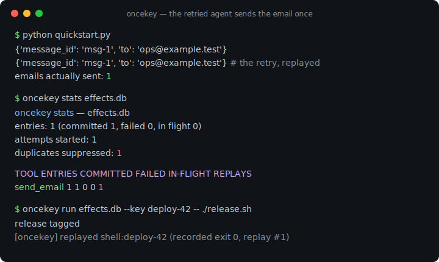
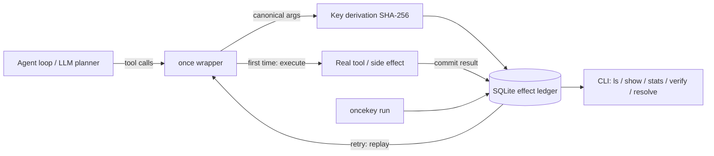

# oncekey

[English](README.md) | [中文](README.zh.md) | [日本語](README.ja.md)

[](LICENSE) [](CHANGELOG.md) [](pyproject.toml)  [](CONTRIBUTING.md)

**oncekey：AI エージェントのツール呼び出しに exactly-once セマンティクスを与えるオープンソースの冪等キーラッパー + SQLite 効果台帳 —— リトライされたエージェントは記録済みの結果を再生し、メールを二重送信したりカードを二重課金したりしない。**



```bash
git clone https://github.com/JaydenCJ/oncekey && cd oncekey && pip install -e .
```

> **プレリリース：** oncekey はまだ PyPI に公開されていません。初回リリースまでは [JaydenCJ/oncekey](https://github.com/JaydenCJ/oncekey) をクローンし、リポジトリのルートで `pip install -e .` を実行してください。

## なぜ oncekey？

エージェントを運用する誰もが同じ恐怖体験を持っています：ツール呼び出しは成功したのに、その*後*のモデル呼び出しがタイムアウトし、リトライループがステップ全体を再実行 —— 顧客にメールが二通届く、あるいは二重に課金される。対策は決済 API の世界では十年来の定石（冪等キー）ですが、既存実装はエージェントツールにとって置き場所が悪い：ワークフローエンジンはコードをサーバークラスタ上の workflow に書き直せと要求し、キューの重複排除はブローカーを通るタスクしか守らず、Redis DIY 路線は Redis の運用とロック・再生・競合チェックの手作りを意味します。oncekey はこの契約一式をデコレータひとつとローカルの SQLite ファイルひとつに収めます：ツールを包めば、同じ引数のリトライは記録済みの結果を再生し、最初の試行がリースを保持する間の並行重複は拒否され、同じキーを別ペイロードで使い回せば間違った答えを返す代わりに大声で失敗します。台帳はただの照会可能なファイル —— `oncekey stats` が二重送信を何回飲み込んだかを正確に教えてくれます。これは効果台帳であって、メッセージキューでもワークフローエンジンでもありません：エージェントは普通の Python 関数を呼び続けるだけです。

|  | oncekey | ワークフローエンジン（Temporal） | キュー重複排除（celery-once） | Redis DIY |
|---|---|---|---|---|
| 素の Python callable にそのまま効く | はい —— デコレータひとつ | いいえ —— workflow/activity への書き直しが必要 | いいえ —— Celery タスク限定 | ラッパーは自作 |
| 必要なインフラ | SQLite ファイルひとつ | サーバークラスタ + データベース | Broker + Redis | 自前運用の Redis |
| リトライ時に記録済み結果を再生 | はい | はい（イベント履歴） | いいえ —— 重複は単に破棄 | 自作 |
| 同キー別ペイロードの再利用を検出 | はい —— 大声で拒否 | 該当なし | いいえ | 自作 |
| 照会可能なローカル効果履歴 | はい —— CLI + SQL | サーバー UI/API 経由 | いいえ | いいえ |
| シェルコマンドの exactly-once（追加実装なし） | はい —— `oncekey run` | いいえ | いいえ | 自作 |
| ランタイム依存 | 0 | SDK + サーバー | celery、redis | redis クライアント |

<sub>比較は 2026-07 時点の各方式の公式なデプロイモデルに基づく：Temporal は稼働中の Temporal Service を必要とし、celery-once は Redis ロックでタスク投入を重複排除するが重複呼び出し元には何も返さない。oncekey の依存数は [pyproject.toml](pyproject.toml) の `dependencies = []` そのもの。</sub>

## 特徴

- **デコレータひとつで exactly-once** —— `@once(ledger)` がツールの束縛済み引数から冪等キーを導出（位置・キーワード・デフォルト値の呼び方はすべて同じキーに正規化）し、どのリトライでも記録済みの結果を再生する。
- **Stripe 流の安全柵** —— 同キー別ペイロードは `KeyConflictError`；最初の試行のリース存続中の並行重複は `InFlightError`；クラッシュした試行はリース失効後に引き継がれ、引き継ぎ後に遅れて届いたコミットは `LeaseLostError` を投げて静かな二重書き込みを許さない。
- **問い詰められる台帳** —— 各効果はローカル SQLite ファイルの一行：`oncekey ls`・`show`・`stats`（*duplicates suppressed* カウンタ付き）・`export` で JSONL・`verify` で指紋照合・`resolve` で人間による裁定。
- **失敗に正直な設計** —— 例外を投げたツールはデフォルトでリトライ可能のまま；非アトミックなツール（「例外が出た」が「実行されなかった」を意味しない場合）には `retry_failed=False`；シリアライズ不能な結果はコミットはするが再生を拒み、値をでっち上げない。
- **シェルコマンドも exactly-once** —— `oncekey run --key deploy-42 -- ./release.sh` は一度だけ実行し、以後のリトライでは記録した stdout/stderr/終了コードを再生する。
- **依存ゼロ・テレメトリゼロ** —— 純粋な Python 標準ライブラリ + `sqlite3`；データは一切マシンを離れず、90 件のオフラインテストとエンドツーエンドのスモークスクリプトで検証済み。

## クイックスタート

インストール：

```bash
git clone https://github.com/JaydenCJ/oncekey && cd oncekey && pip install -e .
```

以下を `quickstart.py` として保存：

```python
from oncekey import Ledger, once

ledger = Ledger("effects.db")
sent = []

@once(ledger, tool="send_email")
def send_email(to: str, subject: str) -> dict:
    sent.append(to)  # imagine the SMTP call here
    return {"message_id": f"msg-{len(sent)}", "to": to}

print(send_email("ops@example.test", "deploy finished"))
print(send_email("ops@example.test", "deploy finished"))  # the agent retried
print(f"emails actually sent: {len(sent)}")
```

実行すると —— 二回目の呼び出しは台帳が答え、再送はされない：

```text
$ python quickstart.py
{'message_id': 'msg-1', 'to': 'ops@example.test'}
{'message_id': 'msg-1', 'to': 'ops@example.test'}
emails actually sent: 1
```

実際に何が起きたか台帳に聞く（出力は実際の実行より）：

```bash
oncekey stats effects.db
```

```text
oncekey stats — effects.db
entries:               1   (committed 1, failed 0, in flight 0)
attempts started:      1
duplicates suppressed: 1

TOOL        ENTRIES  COMMITTED  FAILED  IN-FLIGHT  REPLAYS
send_email        1          1       0          0        1
```

お金の絡むツールではキーを業務識別子に固定する —— 同じキーを別金額で使い回すと再生ではなく拒否になる：

```python
@once(ledger, tool="charge_card", key=lambda a: a["order_id"])
def charge_card(order_id: str, amount_cents: int) -> dict: ...

charge_card("ord-1001", 4200)   # executes
charge_card("ord-1001", 4200)   # replays the recorded charge
charge_card("ord-1001", 9900)   # KeyConflictError: same key, new payload
```

実行可能な二重送信デモは [`examples/`](examples/) に、ディスク上のスキーマは [`docs/ledger-format.md`](docs/ledger-format.md) に文書化されている。

## exactly-once の契約

| 繰り返し呼び出し時の状況 | 挙動 |
|---|---|
| 同キー・同引数・コミット済み | 記録済みの結果を返す；`replays` カウンタが増える |
| 同キー・**異なる**引数 | `KeyConflictError` —— 間違った答えは決して返さない |
| 最初の試行がまだ実行中 | `InFlightError`（リース期限付き） |
| 最初の試行がクラッシュ（リース失効） | 引き継いで実行；遅れたコミットは `LeaseLostError` |
| 前回の試行が例外を投げた | デフォルトで再実行；`retry_failed=False` なら `PreviouslyFailedError` |
| コミット済みだが結果が JSON 化不能だった | `ResultUnavailableError` —— 再生も再実行もしない |
| `ttl=...` の窓が過ぎた | エントリは忘れられ、効果は再実行できる |

キー導出のつまみ：`key=`（明示文字列または callable）、`key_fields=` / `exclude_fields=`（どの引数が「同じ呼び出し」を定義するか）、`record_args=False`（ペイロードをディスクに残さない）。`wrap_tool` と `wrap_toolkit` はフレームワーク由来の callable やツールキット全体を包み、非同期ツールにも同一の契約が適用される。

## CLI リファレンス

| コマンド | 効果 |
|---|---|
| `oncekey ls LEDGER [--tool T] [--status S] [--limit N]` | エントリを新しい順に一覧 |
| `oncekey show LEDGER KEY` | エントリ一件を全項目表示（KEY は一意な前方一致で可） |
| `oncekey stats LEDGER` | 合計、ツール別テーブル、抑止した重複数 |
| `oncekey verify LEDGER` | 指紋と JSON を照合；問題があれば終了コード 1 |
| `oncekey export LEDGER [--tool T] [--status S]` | エントリを JSON Lines で出力 |
| `oncekey purge LEDGER --older-than 7d / --status failed / --expired` | 条件に合うエントリを削除（フィルタ必須） |
| `oncekey resolve LEDGER KEY --commit/--fail/--discard` | 詰まった・誤ったエントリへの人間による裁定 |
| `oncekey run LEDGER [--key K] [--ttl DUR] [--any-exit] -- cmd...` | シェルコマンドを exactly-once で実行 |

```text
$ oncekey run effects.db --key deploy-42 -- ./release.sh
release tagged
$ oncekey run effects.db --key deploy-42 -- ./release.sh
release tagged
[oncekey] replayed shell:deploy-42 (recorded exit 0, replay #1)
```

非ゼロ終了はリトライ可能のまま（例外を投げたツールと同じ扱い）；`--any-exit` なら最終結果として記録する。失敗したコマンドは終了コードを保持するので、`oncekey run` はそのままスクリプトに組み込める。

## 検証

このリポジトリは CI を持ちません；上記の主張はすべてローカル実行で検証されています。このリポジトリのチェックアウトから再現するには：

```bash
pip install -e '.[dev]' && pytest && bash scripts/smoke.sh
```

出力（実際の実行より、`...` で省略）：

```text
90 passed in 2.57s
...
[stats] duplicates suppressed: 2
SMOKE OK
```

## アーキテクチャ



## ロードマップ

- [x] claim/commit/fail のリース台帳、`once`/`wrap_tool`/`wrap_toolkit`、キー導出、TTL 窓、`oncekey run` を含むフル CLI（v0.1.0）
- [ ] PyPI への公開（`pip install oncekey`）
- [ ] `oncekey run` の出力ストリーミング（初回実行時のライブ出力）
- [ ] ラッパーを MCP/LangChain ツールミドルウェアとして公開するアダプタ
- [ ] `args_json`/`result_json` のオプションの保存時暗号化

全リストは [open issues](https://github.com/JaydenCJ/oncekey/issues) を参照。

## コントリビュート

コントリビュート歓迎 —— [good first issue](https://github.com/JaydenCJ/oncekey/issues?q=is%3Aissue+is%3Aopen+label%3A%22good+first+issue%22) から始めるか、[discussion](https://github.com/JaydenCJ/oncekey/discussions) を開いてください。開発環境の構築は [CONTRIBUTING.md](CONTRIBUTING.md) を参照。

## ライセンス

[MIT](LICENSE)
