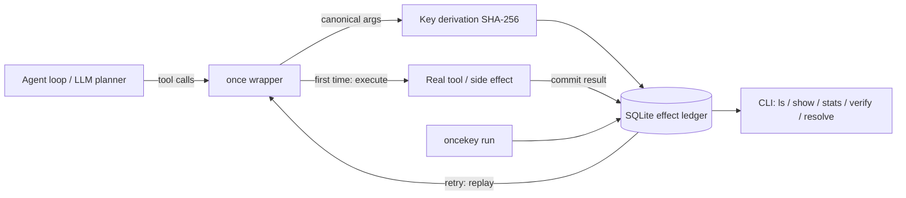

# oncekey

[English](README.md) | [中文](README.zh.md) | [日本語](README.ja.md)

[](LICENSE) [](CHANGELOG.md) [](pyproject.toml)  [](CONTRIBUTING.md)

**oncekey：an open-source idempotency-key wrapper and SQLite effect ledger that gives AI agent tool calls exactly-once semantics — the retried agent replays the recorded result instead of double-sending the email or double-charging the card.**


```bash
git clone https://github.com/JaydenCJ/oncekey && cd oncekey && pip install -e .
```

> **Pre-release:** oncekey is not yet published to PyPI. Until the first release, clone [JaydenCJ/oncekey](https://github.com/JaydenCJ/oncekey) and run `pip install -e .` from the repository root.

## Why oncekey?

Everyone running agents has the same horror story: a tool call succeeds, the model call *after* it times out, the retry loop re-runs the step — and the customer gets two emails, or two charges. The fix has been standard practice in payment APIs for a decade (idempotency keys), but the existing implementations live in the wrong place for agent tools: workflow engines want your code rewritten as workflows on a server cluster, queue deduplication only covers tasks that go through a broker, and the DIY Redis recipe means operating Redis and hand-building the locking, replay, and conflict checks. oncekey puts the whole contract in a decorator and one local SQLite file: wrap the tool, and a retry with the same arguments replays the recorded result, a concurrent duplicate is refused while the first attempt holds its lease, and key reuse with a different payload fails loudly instead of returning the wrong answer. The ledger is a plain queryable file — `oncekey stats` tells you exactly how many double-sends it swallowed. It is an effect ledger, not a message queue and not a workflow engine: your agent keeps calling plain Python functions.

|  | oncekey | Workflow engines (Temporal) | Queue dedup (celery-once) | DIY on Redis |
|---|---|---|---|---|
| Works on plain Python callables | Yes — a decorator | No — rewrite as workflows/activities | No — Celery tasks only | You write the wrapper |
| Infrastructure required | One SQLite file | Server cluster + database | Broker + Redis | Redis you operate |
| Replays the recorded result on retry | Yes | Yes (event history) | No — duplicates are just dropped | You build it |
| Detects key reuse with a changed payload | Yes — refuses loudly | N/A | No | You build it |
| Queryable local effect history | Yes — CLI + SQL | Via server UI/API | No | No |
| Exactly-once shell commands, out of the box | Yes — `oncekey run` | No | No | You build it |
| Runtime dependencies | 0 | SDK + server | celery, redis | redis client |

<sub>Comparison reflects each approach's documented deployment model as of 2026-07: Temporal needs a running Temporal Service; celery-once deduplicates task submission via Redis locks and returns nothing to the duplicate caller. oncekey's dependency count is `dependencies = []` in [pyproject.toml](pyproject.toml).</sub>

## Features

- **Exactly-once in one decorator** — `@once(ledger)` derives an idempotency key from the tool's bound arguments (positional, keyword, and defaulted calls all normalize to the same key) and replays the recorded result on any retry.
- **Stripe-shaped safety rails** — same key with a different payload raises `KeyConflictError`; a concurrent duplicate gets `InFlightError` while the first attempt's lease is live; crashed attempts are taken over when the lease expires, and a late commit after takeover raises `LeaseLostError` instead of silently double-writing.
- **A ledger you can interrogate** — every effect is one row in a local SQLite file: `oncekey ls`, `show`, `stats` (with a *duplicates suppressed* counter), `export` to JSONL, `verify` to cross-check fingerprints, and `resolve` for human overrides.
- **Failure-honest by design** — a tool that raised stays retryable by default; pass `retry_failed=False` for non-atomic tools where "it raised" does not prove "it did not happen"; results that cannot be serialized commit but refuse replay rather than inventing a value.
- **Exactly-once for shell commands too** — `oncekey run --key deploy-42 -- ./release.sh` executes once and replays the recorded stdout/stderr/exit code on every retry.
- **Zero dependencies, zero telemetry** — pure Python stdlib on top of `sqlite3`; nothing leaves your machine, verified by 90 offline tests plus an end-to-end smoke script.

## Quickstart

Install:

```bash
git clone https://github.com/JaydenCJ/oncekey && cd oncekey && pip install -e .
```

Save this as `quickstart.py`:

```python
from oncekey import Ledger, once

ledger = Ledger("effects.db")
sent = []

@once(ledger, tool="send_email")
def send_email(to: str, subject: str) -> dict:
    sent.append(to)  # imagine the SMTP call here
    return {"message_id": f"msg-{len(sent)}", "to": to}

print(send_email("ops@example.test", "deploy finished"))
print(send_email("ops@example.test", "deploy finished"))  # the agent retried
print(f"emails actually sent: {len(sent)}")
```

Run it — the second call is answered from the ledger, not by sending again:

```text
$ python quickstart.py
{'message_id': 'msg-1', 'to': 'ops@example.test'}
{'message_id': 'msg-1', 'to': 'ops@example.test'}
emails actually sent: 1
```

Ask the ledger what actually happened (output copied from a real run):

```bash
oncekey stats effects.db
```

```text
oncekey stats — effects.db
entries:               1   (committed 1, failed 0, in flight 0)
attempts started:      1
duplicates suppressed: 1

TOOL        ENTRIES  COMMITTED  FAILED  IN-FLIGHT  REPLAYS
send_email        1          1       0          0        1
```

For money-shaped tools, pin the key to your business identifier — reusing it with a different amount is then refused instead of replayed:

```python
@once(ledger, tool="charge_card", key=lambda a: a["order_id"])
def charge_card(order_id: str, amount_cents: int) -> dict: ...

charge_card("ord-1001", 4200)   # executes
charge_card("ord-1001", 4200)   # replays the recorded charge
charge_card("ord-1001", 9900)   # KeyConflictError: same key, new payload
```

A runnable double-send demo lives in [`examples/`](examples/), and the on-disk schema is documented in [`docs/ledger-format.md`](docs/ledger-format.md).

## The exactly-once contract

| Situation on a repeated call | Behavior |
|---|---|
| Same key, same arguments, committed | Recorded result is returned; `replays` counter increments |
| Same key, **different** arguments | `KeyConflictError` — never the wrong answer |
| First attempt still executing | `InFlightError` with the lease deadline |
| First attempt crashed (lease expired) | Taken over and executed; a late commit raises `LeaseLostError` |
| Previous attempt raised | Re-executes by default; `retry_failed=False` raises `PreviouslyFailedError` |
| Committed, but result was not JSON-serializable | `ResultUnavailableError` — no replay, no re-execution |
| `ttl=...` window has lapsed | Entry is forgotten; the effect may run again |

Key derivation knobs: `key=` (explicit string or callable), `key_fields=` / `exclude_fields=` (which arguments define "the same call"), `record_args=False` (keep payloads off disk). `wrap_tool` and `wrap_toolkit` wrap framework-provided callables and whole toolkits; async tools get the identical contract.

## CLI reference

| Command | Effect |
|---|---|
| `oncekey ls LEDGER [--tool T] [--status S] [--limit N]` | List entries, newest first |
| `oncekey show LEDGER KEY` | One entry in full (KEY may be a unique prefix) |
| `oncekey stats LEDGER` | Totals, per-tool table, duplicates suppressed |
| `oncekey verify LEDGER` | Cross-check fingerprints and JSON; exit 1 on issues |
| `oncekey export LEDGER [--tool T] [--status S]` | Dump entries as JSON Lines |
| `oncekey purge LEDGER --older-than 7d / --status failed / --expired` | Delete matching entries (a filter is required) |
| `oncekey resolve LEDGER KEY --commit/--fail/--discard` | Human override for a stuck or wrong entry |
| `oncekey run LEDGER [--key K] [--ttl DUR] [--any-exit] -- cmd...` | Run a shell command exactly once |

```text
$ oncekey run effects.db --key deploy-42 -- ./release.sh
release tagged
$ oncekey run effects.db --key deploy-42 -- ./release.sh
release tagged
[oncekey] replayed shell:deploy-42 (recorded exit 0, replay #1)
```

Non-zero exits stay retryable (like a tool that raised); `--any-exit` records them as final. Failed commands keep their exit code, so `oncekey run` slots directly into scripts.

## Verification

This repository ships no CI; every claim above is verified by local runs. Reproduce them from a checkout of this repository:

```bash
pip install -e '.[dev]' && pytest && bash scripts/smoke.sh
```

Output (copied from a real run, truncated with `...`):

```text
90 passed in 2.57s
...
[stats] duplicates suppressed: 2
SMOKE OK
```

## Architecture



## Roadmap

- [x] Claim/commit/fail lease ledger, `once`/`wrap_tool`/`wrap_toolkit`, key derivation, TTL windows, full CLI incl. `oncekey run` (v0.1.0)
- [ ] PyPI release with `pip install oncekey`
- [ ] Response streaming for `oncekey run` (live output on first execution)
- [ ] Adapters exposing the wrapper as MCP/LangChain tool middleware
- [ ] Optional encryption-at-rest for `args_json`/`result_json`

See the [open issues](https://github.com/JaydenCJ/oncekey/issues) for the full list.

## Contributing

Contributions are welcome — start with a [good first issue](https://github.com/JaydenCJ/oncekey/issues?q=is%3Aissue+is%3Aopen+label%3A%22good+first+issue%22) or open a [discussion](https://github.com/JaydenCJ/oncekey/discussions). See [CONTRIBUTING.md](CONTRIBUTING.md) for the development setup.

## License

[MIT](LICENSE)
