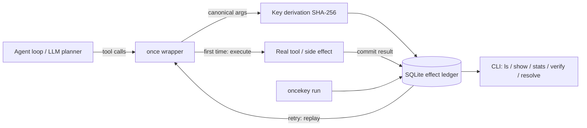

# oncekey

[English](README.md) | [中文](README.zh.md) | [日本語](README.ja.md)

[](LICENSE) [](CHANGELOG.md) [](pyproject.toml)  [](CONTRIBUTING.md)

**oncekey：开源的幂等键包装器 + SQLite 效果台账，为 AI agent 的工具调用提供"恰好一次"语义 —— 被重试的 agent 会回放已记录的结果，而不是把邮件发两遍、把卡扣两次。**


```bash
git clone https://github.com/JaydenCJ/oncekey && cd oncekey && pip install -e .
```

> **预发布：** oncekey 尚未发布到 PyPI。在首个正式版之前，请克隆 [JaydenCJ/oncekey](https://github.com/JaydenCJ/oncekey) 并在仓库根目录执行 `pip install -e .`。

## 为什么要用 oncekey？

跑过 agent 的人都有同一个恐怖故事：工具调用成功了，*之后*的模型调用超时，重试循环把整个步骤重新执行 —— 客户收到两封邮件，或者被扣了两次款。解法在支付 API 界已是十年的标准做法（幂等键），但现有实现对 agent 工具来说都放错了位置：工作流引擎要求把代码重写成跑在服务器集群上的 workflow，队列去重只覆盖走 broker 的任务，而 Redis DIY 方案意味着要运维 Redis 并手搓加锁、回放和冲突检查。oncekey 把整套契约装进一个装饰器和一个本地 SQLite 文件：包上工具，参数相同的重试就回放已记录的结果，第一次尝试持有租约期间的并发重复会被拒绝，同一个键换了载荷则大声报错而不是返回错误答案。台账就是一个可查询的普通文件 —— `oncekey stats` 会告诉你它到底吞掉了多少次重复发送。它是效果台账，不是消息队列也不是工作流引擎：你的 agent 继续调用普通的 Python 函数。

|  | oncekey | 工作流引擎（Temporal） | 队列去重（celery-once） | Redis DIY |
|---|---|---|---|---|
| 直接作用于普通 Python 可调用对象 | 是 —— 一个装饰器 | 否 —— 需重写成 workflow/activity | 否 —— 仅限 Celery 任务 | 包装器自己写 |
| 所需基础设施 | 一个 SQLite 文件 | 服务器集群 + 数据库 | Broker + Redis | 自己运维的 Redis |
| 重试时回放已记录的结果 | 是 | 是（事件历史） | 否 —— 重复调用直接被丢弃 | 自己实现 |
| 检测同键换载荷的复用 | 是 —— 大声拒绝 | 不适用 | 否 | 自己实现 |
| 可查询的本地效果历史 | 是 —— CLI + SQL | 经服务器 UI/API | 否 | 否 |
| 开箱即用的 shell 命令恰好一次执行 | 是 —— `oncekey run` | 否 | 否 | 自己实现 |
| 运行时依赖 | 0 | SDK + 服务器 | celery、redis | redis 客户端 |

<sub>对比基于各方案截至 2026-07 的官方部署模型：Temporal 需要运行 Temporal Service；celery-once 通过 Redis 锁对任务提交去重，且不向重复调用方返回任何结果。oncekey 的依赖数即 [pyproject.toml](pyproject.toml) 中的 `dependencies = []`。</sub>

## 特性

- **一个装饰器实现恰好一次** —— `@once(ledger)` 从工具的绑定参数派生幂等键（位置、关键字、默认值调用都归一到同一个键），任何重试都回放已记录的结果。
- **Stripe 式安全护栏** —— 同键不同载荷抛 `KeyConflictError`；首次尝试租约存续期间的并发重复得到 `InFlightError`；崩溃的尝试在租约过期后被接管，接管后迟到的提交抛 `LeaseLostError`，绝不静默双写。
- **可以审问的台账** —— 每个效果就是本地 SQLite 文件里的一行：`oncekey ls`、`show`、`stats`（带 *duplicates suppressed* 计数）、`export` 导出 JSONL、`verify` 复核指纹、`resolve` 供人工裁决。
- **对失败诚实** —— 抛过异常的工具默认可重试；对非原子工具（"抛了异常"不代表"没有生效"）传 `retry_failed=False`；无法序列化的结果照常提交但拒绝回放，绝不凭空捏造值。
- **shell 命令同样恰好一次** —— `oncekey run --key deploy-42 -- ./release.sh` 只执行一次，之后的每次重试都回放记录的 stdout/stderr/退出码。
- **零依赖、零遥测** —— 纯 Python 标准库加 `sqlite3`；任何数据都不离开你的机器，由 90 个离线测试加端到端冒烟脚本验证。

## 快速上手

安装：

```bash
git clone https://github.com/JaydenCJ/oncekey && cd oncekey && pip install -e .
```

将以下内容存为 `quickstart.py`：

```python
from oncekey import Ledger, once

ledger = Ledger("effects.db")
sent = []

@once(ledger, tool="send_email")
def send_email(to: str, subject: str) -> dict:
    sent.append(to)  # imagine the SMTP call here
    return {"message_id": f"msg-{len(sent)}", "to": to}

print(send_email("ops@example.test", "deploy finished"))
print(send_email("ops@example.test", "deploy finished"))  # the agent retried
print(f"emails actually sent: {len(sent)}")
```

运行它 —— 第二次调用由台账作答，而不是再发一次：

```text
$ python quickstart.py
{'message_id': 'msg-1', 'to': 'ops@example.test'}
{'message_id': 'msg-1', 'to': 'ops@example.test'}
emails actually sent: 1
```

问问台账到底发生了什么（输出摘自真实运行）：

```bash
oncekey stats effects.db
```

```text
oncekey stats — effects.db
entries:               1   (committed 1, failed 0, in flight 0)
attempts started:      1
duplicates suppressed: 1

TOOL        ENTRIES  COMMITTED  FAILED  IN-FLIGHT  REPLAYS
send_email        1          1       0          0        1
```

对于跟钱有关的工具，把键钉在业务标识符上 —— 同键换金额的复用会被拒绝而不是回放：

```python
@once(ledger, tool="charge_card", key=lambda a: a["order_id"])
def charge_card(order_id: str, amount_cents: int) -> dict: ...

charge_card("ord-1001", 4200)   # executes
charge_card("ord-1001", 4200)   # replays the recorded charge
charge_card("ord-1001", 9900)   # KeyConflictError: same key, new payload
```

可运行的重复发送演示在 [`examples/`](examples/)，磁盘上的 schema 文档见 [`docs/ledger-format.md`](docs/ledger-format.md)。

## 恰好一次契约

| 重复调用时的情形 | 行为 |
|---|---|
| 同键、同参数、已提交 | 返回已记录的结果；`replays` 计数递增 |
| 同键、**不同**参数 | `KeyConflictError` —— 绝不返回错误答案 |
| 首次尝试仍在执行 | `InFlightError`，附带租约到期时间 |
| 首次尝试崩溃（租约已过期） | 被接管并执行；迟到的提交抛 `LeaseLostError` |
| 上一次尝试抛了异常 | 默认重新执行；`retry_failed=False` 时抛 `PreviouslyFailedError` |
| 已提交，但结果无法 JSON 序列化 | `ResultUnavailableError` —— 不回放，也不重跑 |
| `ttl=...` 窗口已过 | 条目被遗忘；效果可以再次执行 |

键派生的旋钮：`key=`（显式字符串或可调用对象）、`key_fields=` / `exclude_fields=`（哪些参数定义"同一次调用"）、`record_args=False`（不把载荷落盘）。`wrap_tool` 和 `wrap_toolkit` 可包装框架给的可调用对象和整个工具集；异步工具享有完全相同的契约。

## CLI 参考

| 命令 | 效果 |
|---|---|
| `oncekey ls LEDGER [--tool T] [--status S] [--limit N]` | 列出条目，最新在前 |
| `oncekey show LEDGER KEY` | 完整展示一个条目（KEY 可以是唯一前缀） |
| `oncekey stats LEDGER` | 总计、按工具分表、抑制的重复数 |
| `oncekey verify LEDGER` | 复核指纹与 JSON；发现问题以 1 退出 |
| `oncekey export LEDGER [--tool T] [--status S]` | 以 JSON Lines 导出条目 |
| `oncekey purge LEDGER --older-than 7d / --status failed / --expired` | 删除匹配条目（必须给过滤条件） |
| `oncekey resolve LEDGER KEY --commit/--fail/--discard` | 对卡住或写错的条目做人工裁决 |
| `oncekey run LEDGER [--key K] [--ttl DUR] [--any-exit] -- cmd...` | 恰好一次地运行一条 shell 命令 |

```text
$ oncekey run effects.db --key deploy-42 -- ./release.sh
release tagged
$ oncekey run effects.db --key deploy-42 -- ./release.sh
release tagged
[oncekey] replayed shell:deploy-42 (recorded exit 0, replay #1)
```

非零退出保持可重试（和抛异常的工具一样）；`--any-exit` 会把它们记为终态。失败的命令保留原退出码，因此 `oncekey run` 可直接嵌进脚本。

## 验证

本仓库不带 CI；上述所有断言都由本地运行验证。从本仓库的检出中复现：

```bash
pip install -e '.[dev]' && pytest && bash scripts/smoke.sh
```

输出（摘自真实运行，以 `...` 截断）：

```text
90 passed in 2.57s
...
[stats] duplicates suppressed: 2
SMOKE OK
```

## 架构



## 路线图

- [x] claim/commit/fail 租约台账、`once`/`wrap_tool`/`wrap_toolkit`、键派生、TTL 窗口、含 `oncekey run` 的完整 CLI（v0.1.0）
- [ ] 发布到 PyPI，支持 `pip install oncekey`
- [ ] `oncekey run` 的输出流式化（首次执行时实时输出）
- [ ] 把包装器暴露为 MCP/LangChain 工具中间件的适配器
- [ ] `args_json`/`result_json` 的可选静态加密

完整列表见 [open issues](https://github.com/JaydenCJ/oncekey/issues)。

## 贡献

欢迎贡献 —— 从一个 [good first issue](https://github.com/JaydenCJ/oncekey/issues?q=is%3Aissue+is%3Aopen+label%3A%22good+first+issue%22) 开始，或发起一个 [discussion](https://github.com/JaydenCJ/oncekey/discussions)。开发环境搭建见 [CONTRIBUTING.md](CONTRIBUTING.md)。

## 许可证

[MIT](LICENSE)
